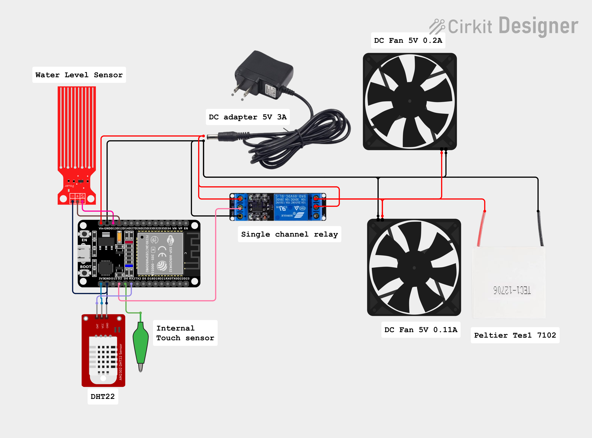
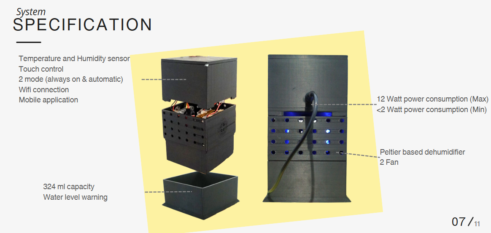
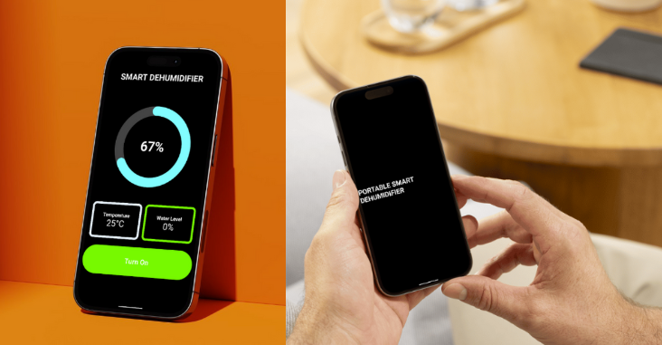

# 💧🚫 Smart Dehumidifier
by: 
##### Muhammad Rafie Habibi Fauzi -235150301111009
#####  Phasa Vigo Khalil Nugroho - 235150300111004
#####  Peter Abednego Wijaya - 235150300111013
##### Gilang Shido Faizalhaq - 235150300111011
#####  Adi Baskara Husodo - 235150300111050
---

A smart and portable dehumidifier powered by **ESP32**, **Firebase**, and **WiFi** for real-time monitoring and control via mobile.

---

###  Problems

####  1. Environmental Humidity

- **High room humidity** (above 60%) can lead to:
  - Mold and mildew growth
  - Damage to electronics, furniture, and walls
  - Musty smells and uncomfortable air quality

####  2. Impact on Human Health

- Prolonged exposure to humid environments can cause:
  - Respiratory issues such as asthma and allergies
  - Skin irritation and increased sweat production
  - Fatigue and discomfort, especially during sleep

---

###  Existing Solutions

| Type                         | Description                                                     | Drawbacks                                        |
|------------------------------|-----------------------------------------------------------------|--------------------------------------------------|
| **Chemical Dehumidifier**    | Uses silica gel or calcium chloride to absorb moisture          | Non-reusable, short lifespan, generates waste    |
| **Conventional Electric**    | Electric units with compressor or thermoelectric modules        | Bulky, expensive, no remote monitoring/control   |

---

### ✨ Why Smart Dehumidifier?

| Feature                        | Smart TAC Dehumidifier                       | Conventional Solutions       |
|--------------------------------|---------------------------------------------|-------------------------------|
| Real-time humidity monitoring  | ✅ Yes (via Firebase + App)                 | ❌ No                          |
| Remote control                 | ✅ Yes (Bluetooth & Internet)               | ❌ No                          |
| Compact & customizable         | ✅ Yes (ESP32 + small components)           | ❌ Mostly bulky or don't have remote control   |
| Remote display                 | ✅ Yes (App)                                | ❌ Limited or none             |
| Power efficiency 12 Watt Max (Customable)             | ✅ Optimized via software + relay control   | ❌ Often inefficient    |

---

### 🎯 Goals

- Real-time humidity, temperature, and water level monitoring
- Remote ON/OFF and AUTO control
- Android app integration with Firebase

---

### 🔧 Components

| Component              | Description                          |
|------------------------|--------------------------------------|
| ESP32 Dev Board        | Main microcontroller with WiFi+BLE   |
| Peltier Module Tes-1 7102 | Cooling system for dehumidification  |
|Heatsink | Cooling support for the hot side of the peltier module |
| 2 x Fan (5V)               | Supports airflow                     |
| Relay Module           | Controls Peltier and fan             |
| Humidity Sensor DHT 22       | Senses environmental humidity and temperature        |
| Water Level Sensor     | Detects full water tank              |
| Android Studio            | Firebase-connected mobile interface  |
| 5V 3A Adapter          | Power source                         |

### ⚡Circuit diagram
This is the circuit 
- 
- ⚠️⚠️Place the heatsink + 1 Fan at the hot side of the peltier ⚠️⚠️
- The other fan is used for suck the air into the dehumidifier case
---

###  Sequence Diagram

###  Development Steps

#### 1. Firebase Setup

- Create Firebase Project: [https://console.firebase.google.com](https://console.firebase.google.com)
- Enable Realtime Database and Authentication
- Create nodes :
  - `/humidity`
  - `/temperature`
  - `/waterLevel`
  - `/control/onOff/auto` (Number, 0 = Off, 1 = On, 2 = Auto mode)
- Set rules:
  - `{
  "rules": {
    ".read": true,  
    ".write": true  
  }`
  -** Remember, this is just for prototyping; it's better to restrict your real-time database access**
- Enable **Email/Password** sign-in method using Firebase Authentication
  - Make an account for the ESP-32, then put it in
  - `#define USER_EMAIL "Firebase user email"
#define USER_PASSWORD "Firebase user password"`
- Connect it to your apps
  - Open `Settings` (next to "project overview)
  - Make a Web App key and download the `google-services.json` file 

#### 2. Android App (Jetpack Compose)
_ Make a project on Android Studio 
- Connect your database
  - Copy the `google-services.json` file (Replace mine) 
  - Put it in the `Project/src` folder
- Add the Firebase SDK:
  - Go to `tool` -> `Firebase` 
  - Choose a real-time database and authentication
  - Connect your app to Firebase
  - Then, Add the Firebase ... SDK to your App
  - Lastly, sync your Project with Gradle Files 
- Features:
  - Dashboard for sensor data
  - ON/OFF & AUTO buttons

#### 3. ESP32 Firmware

- Firebase connectivity
- Sensor readings
- Relay control
- FreeRTOS task handling
---
## Result 

